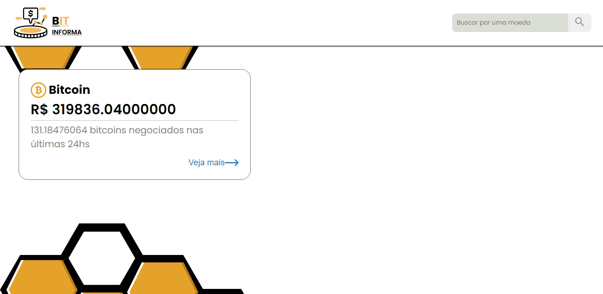
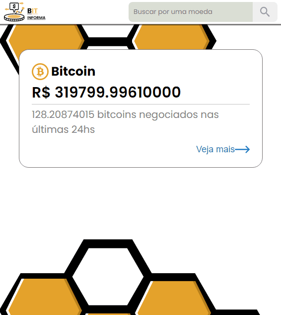

<h1 style="text-align: center; font-weight: bold;">Bit Informa</h1>

## Demo 📸

  
  

## Sobre o Projeto

Esta aplicação fornece todos os dados importantes sobre as criptomoedas.
Basta o usuário informar a criptomoeda informada para obter todos detalhes

Para ver o **Design**, clique aqui: [Figma](https://www.figma.com/file/tBpVfio7mRfECMEtcnIMXF/Untitled?node-id=0%3A1
)  

### Tecnologias

As seguintes ferramentas foram usadas na construção do projeto:

- [TypeScript](https://www.typescriptlang.org/)
- [React](https://pt-br.reactjs.org/)
- [Axios](https://github.com/axios/axios)
- [React Router Dom](https://reactrouter.com/web/guides/quick-start)

### OBS

Essa aplicação é um teste do processo seletico para Elliptic Technology
